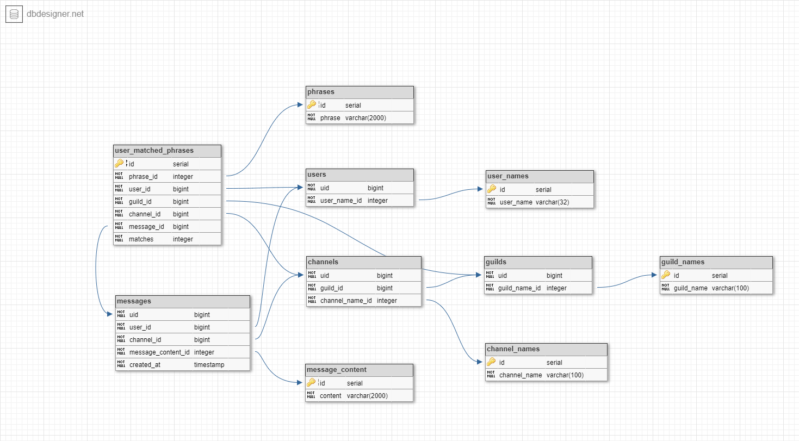

# Gamer Bot
A Discord bot that logs user phrase usage. 

## Requirements

* Python 3.6
* PostgreSQL 12

## Setup

1. Follow the instructions in [create-discord-bot](https://github.com/peterthehan/create-discord-bot).

2. Install the required python modules `pip install -r requirements.txt`

3. Update `gamerbot.cfg.example` with your credentials and save it as `gamerbot.cfg`

4. Execute the sql in `schema/gamer-bot_postgres_create.sql` to set up the Postgres table structure. 

5. (Optional) Change the phrases in the `gamberbot.cfg` file as comma separated, ignore all other punctuation. 

## Running 

`python main.py`

## Design

